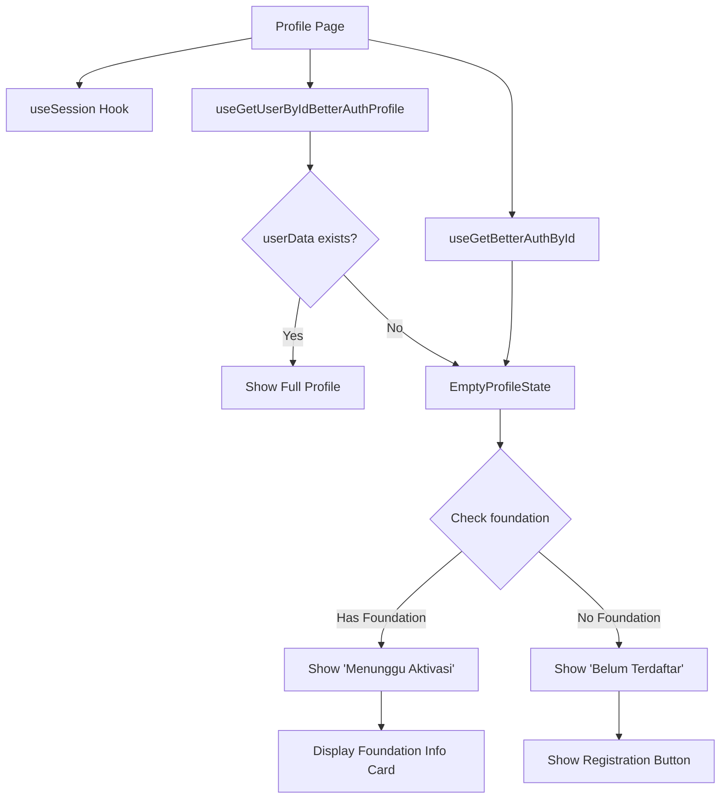

# Profile Page Update Summary

## ✅ What Was Completed

### 1. Updated `betterauthUser` Type

**File**: `app/(types)/types/betterauth-types.ts`

Added support for foundation data at both User and UserData levels:

```typescript
export type betterauthUser = {
  // ... existing fields
  foundationId?: string | null;
  foundation?: {
    id: string;
    name: string;
    code: string;
    createdAt: string;
    updatedAt: string;
  } | null;
  userData?: {
    // ... existing userData fields
    foundationId?: string | null;
    foundation?: {
      id: string;
      name: string;
      code: string;
      createdAt: string;
      updatedAt: string;
    } | null;
    // ... rest of userData
  } | null; // Made userData optional
};
```

### 2. Created New `EmptyProfileState` Component

**File**: `components/profile/EmptyProfileState.tsx`

This new component:

- ✅ Accepts both `session` and `userBetterAuth` props
- ✅ Detects if user has foundation assignment
- ✅ Shows different UI based on foundation status:
  - **Has Foundation**: "Menunggu Aktivasi" (Waiting for Activation)
  - **No Foundation**: "Belum Terdaftar" (Not Registered)
- ✅ Displays foundation information card when foundation exists
- ✅ Shows foundation name and code
- ✅ Provides contextual help text

### 3. Updated Profile Page

**File**: `app/(frontend)/(dashboard)/dashboard/profile/page.tsx`

Changes:

- ✅ Added import for `useGetBetterAuthById` hook
- ✅ Added import for new `EmptyProfileState` component
- ✅ Fetches `userBetterAuth` data in main component
- ✅ Passes `userBetterAuth` to `EmptyProfileState`

---

## 🔄 What Still Needs To Be Done

### Manual Step Required

Due to formatting complexity, you need to **manually remove the old `EmptyProfileState` definition** from the profile page:

**File to edit**: `app/(frontend)/(dashboard)/dashboard/profile/page.tsx`

**Lines to delete**: Approximately lines 157-358 (the old inline `EmptyProfileState` component)

**What to remove**:

```typescript
// Remove this entire block:

// Empty Profile State - When userData doesn't exist
interface EmptyProfileStateProps {
  session: any;
  userBetterAuth?: any;
}

const EmptyProfileState = ({
  session,
  userBetterAuth,
}: EmptyProfileStateProps) => {
  // ... entire old component definition ...
};
```

**What to keep**:

- Keep the import: `import { EmptyProfileState } from "@/components/profile/EmptyProfileState";`
- Keep the usage: `<EmptyProfileState session={session} userBetterAuth={userBetterAuth} />`
- Keep all other components (`UserProfileSkeleton`, `StatCard`, `InfoItem`, etc.)

---

## 🎯 How It Works

### Data Flow:



### Three User States:

#### 1. **Complete Profile** (userData exists + foundation exists)

```typescript
user = {
  id: "...",
  name: "...",
  foundation: { name: "Yayasan Sera", code: "SERA001" },
  // ... full profile data
};
```

→ Shows full profile page with stats, academic info, etc.

#### 2. **Pending Activation** (NO userData BUT foundation assigned on User)

```typescript
userBetterAuth = {
  id: "...",
  name: "...",
  email: "...",
  foundationId: "foundation-id",
  foundation: { name: "Yayasan Sera", code: "SERA001" },
  userData: null, // Not yet created
};
```

→ Shows `EmptyProfileState` with:

- ✅ Foundation info card (green/success themed)
- ✅ "Menunggu Aktivasi" badge (yellow warning)
- ✅ Message: "Contact admin to activate your account"
- ❌ NO "Daftar ke Yayasan" button (already registered)

#### 3. **Not Registered** (NO userData AND NO foundation)

```typescript
userBetterAuth = {
  id: "...",
  name: "...",
  email: "...",
  foundationId: null,
  foundation: null,
  userData: null,
};
```

→ Shows `EmptyProfileState` with:

- ❌ NO foundation info card
- ✅ "Belum Terdaftar" badge (red/destructive)
- ✅ Message: "You need to register to a foundation"
- ✅ "Daftar ke Yayasan" button → navigates to registration

---

## 📋 Component Structure

### EmptyProfileState Component Features:

```tsx
<EmptyProfileState
  session={session} // From useSession()
  userBetterAuth={userBetterAuth} // From useGetBetterAuthById()
/>
```

**Renders**:

1. **Profile Photo** (from session or userBetterAuth)
2. **Status Badge** (dynamic based on foundation)
3. **Alert** (different message based on foundation)
4. **Foundation Info Card** (only if foundation exists)
   - Foundation name
   - Foundation code
   - Membership status badge
5. **Session Details Card** (always shown)
   - Name
   - Email
   - User ID
   - Email verification status
6. **Action Buttons** (conditional)
   - "Daftar ke Yayasan" (only if NO foundation)
   - "Kembali ke Dashboard" (always)
7. **Help Text** with admin contact
8. **Next Steps Card** (context-specific instructions)

---

## 🧪 Testing Scenarios

### Test Case 1: User with Foundation but No UserData

```sql
-- Setup: User with foundation but no userData
UPDATE "user"
SET "foundationId" = 'foundation-id-here'
WHERE id = 'user-id-here';

-- Ensure userData doesn't exist
DELETE FROM "user_data"
WHERE "userId" = 'user-id-here';
```

**Expected Result**:

- ✅ Profile page shows `EmptyProfileState`
- ✅ Foundation info card is visible
- ✅ Shows foundation name and code
- ✅ Badge says "Menunggu Aktivasi"
- ✅ Alert says "Anda sudah terdaftar di yayasan, tetapi profil Anda belum diaktifkan"
- ✅ NO "Daftar ke Yayasan" button
- ✅ Shows "Hubungi administrator yayasan Anda untuk aktivasi akun"

### Test Case 2: User Without Foundation and No UserData

```sql
-- Setup: User without foundation and no userData
UPDATE "user"
SET "foundationId" = NULL
WHERE id = 'user-id-here';

-- Ensure userData doesn't exist
DELETE FROM "user_data"
WHERE "userId" = 'user-id-here';
```

**Expected Result**:

- ✅ Profile page shows `EmptyProfileState`
- ❌ NO foundation info card
- ✅ Badge says "Belum Terdaftar"
- ✅ Alert says "Anda sudah login, tetapi belum terdaftar di yayasan manapun"
- ✅ "Daftar ke Yayasan" button is visible
- ✅ Shows "Daftar ke yayasan dengan kode yayasan yang valid"

### Test Case 3: User with Full Profile (existing functionality)

```sql
-- Setup: User with userData
SELECT * FROM "user_data"
WHERE "userId" = 'user-id-here';
-- Should return a record
```

**Expected Result**:

- ✅ Profile page shows full profile
- ✅ Hero section with avatar
- ✅ Stats cards (Yayasan, Class, Branch, Academic Year, Role)
- ✅ Personal information card
- ✅ Academic information card
- ✅ Professional information card (if applicable)

---

## 🔧 API Endpoint Used

### POST `/api/betterauth/users`

**Request**:

```json
{
  "userId": "user-id-string"
}
```

**Response** (when foundation exists):

```json
{
  "id": "user-id",
  "name": "John Doe",
  "email": "john@example.com",
  "image": "...",
  "foundationId": "foundation-id",
  "foundation": {
    "id": "foundation-id",
    "name": "Yayasan Pendidikan Santosatechid",
    "code": "YAYASAN001",
    "createdAt": "2024-01-01T00:00:00.000Z",
    "updatedAt": "2024-01-01T00:00:00.000Z"
  },
  "userData": null
}
```

**Response** (when no foundation):

```json
{
  "id": "user-id",
  "name": "John Doe",
  "email": "john@example.com",
  "image": "...",
  "foundationId": null,
  "foundation": null,
  "userData": null
}
```

---

## 📝 Code Snippets

### Hook Usage in Profile Page:

```typescript
export default function Home() {
  const { data: session } = useSession();
  const {
    data: user,
    isPending: userLoading,
    isError: userError,
  } = useGetUserByIdBetterAuthProfile(session?.user?.id ?? "");

  const userId = session?.user.id;
  const { data: userBetterAuth } = useGetBetterAuthById(userId as string);

  // ... loading states ...

  // If no userData but we have session, pass userBetterAuth
  if (!user) {
    return <EmptyProfileState session={session} userBetterAuth={userBetterAuth} />;
  }

  // If userData exists but no foundation, also pass userBetterAuth
  if (!user.foundation) {
    return <EmptyProfileState session={session} userBetterAuth={userBetterAuth} />;
  }

  // Otherwise show full profile
  return <FullProfileView user={user} />;
}
```

### Foundation Detection Logic:

```typescript
const hasFoundation = userBetterAuth?.foundation || userBetterAuth?.foundationId;

// Conditional rendering:
{hasFoundation ? (
  <Badge variant="default">Menunggu Aktivasi</Badge>
) : (
  <Badge variant="secondary">Belum Terdaftar</Badge>
)}

// Conditional info card:
{hasFoundation && (
  <Card className="bg-success-surface border-success-border">
    {/* Foundation details */}
  </Card>
)}

// Conditional button:
{!hasFoundation && (
  <Button onClick={() => router.push("/landing/register/foundation")}>
    Daftar ke Yayasan
  </Button>
)}
```

---

## ✅ Summary

### What This Update Achieves:

1. **Better UX for pending users**: Users who have been added to a foundation but don't have userData yet now see:
   - Their foundation name and code
   - A clear "waiting for activation" status
   - Instructions to contact admin

2. **Clear state differentiation**:
   - **Pending activation** (has foundation) vs **Not registered** (no foundation)
   - Different badges, messages, and action buttons for each state

3. **Improved data visibility**:
   - Foundation information is now displayed even when userData doesn't exist
   - Uses `useGetBetterAuthById` to fetch User table data with foundation relation

4. **Cleaner architecture**:
   - Extracted `EmptyProfileState` into separate component file
   - Better separation of concerns
   - Easier to maintain and test

### Files Modified:

1. ✅ `app/(types)/types/betterauth-types.ts` - Added foundation fields
2. ✅ `components/profile/EmptyProfileState.tsx` - New component (created)
3. ✅ `app/(frontend)/(dashboard)/dashboard/profile/page.tsx` - Updated imports and usage

### Manual Action Required:

- ⚠️ Remove old `EmptyProfileState` definition from profile page (lines ~157-358)

---

_Created: 2024-09-14_  
_Purpose: Document profile page enhancement to show foundation info for pending users_
